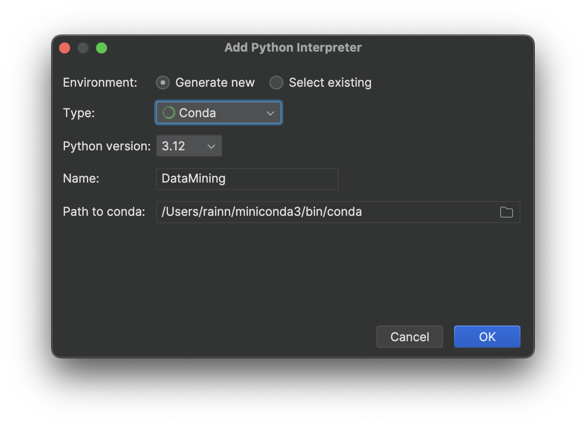
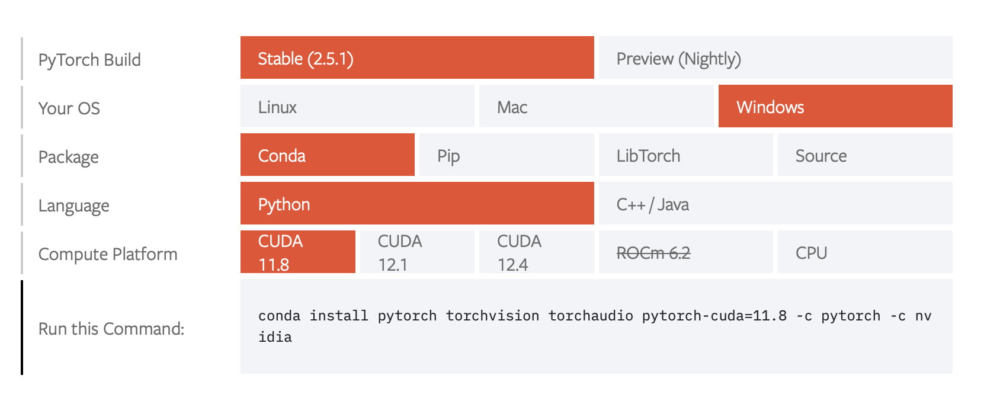
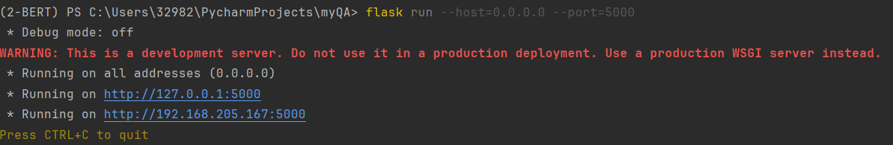

# My final project of the NLP course

*On Mar 21st, update and leave this message:*

*保留此界面以铭记那段合作的时光。*

*并未对此深入研究，仅仅是跑通了别人的代码，后加以定制，完成结课项目。*

*感谢开源精神。*

## Flask项目结构

```
myQA/
│
├── app.py              # Flask 应用主文件
├── templates/
│   └── index.html      # HTML 页面模板
├── static/             # 静态资源文件（例如 CSS）
│   └── style.css       # 网页样式（CSS 文件）
├── fengchao-bert-qa/   # 已经训练好的模型文件
│	└── [模型相关文件...]
├──img/
│	└── *.PNG/jpg	# 用于存放图片，目前只有README用到
├──	testdoc.txt	# 一段文本，可以用于提问
└──	my-QA-min.ipynb	# 测试模型能否在本机上运行所需的最小代码（内置测试文本与问题）
```


## 运行

1. **把模型文件夹放到项目文件夹下**，如项目结构图所示。然后，在PyCharm中打开项目myQA。

**建议为此项目使用新的解释器，避免包版本冲突，影响其他作业项目。推荐使用conda。*



2. **安装PyTorch。**  请查阅[PyTorch官网](https://pytorch.org/get-started/locally/)选择适合自己机器的下载方式，比如你的设备可能配有RTX GPU，且安装了CUDA Toolkit，或者你使用Mac设备；以及使用Python解释器或者conda解释器，下载内容都会有所差异。

比如我的Windows主机安装了CUDA 11.8，使用Conda解释器，则安装命令如下：

```
$ conda install pytorch torchvision torchaudio pytorch-cuda=11.8 -c pytorch -c nvidia
```


<br>
<br>

3. **运行[my-QA-min.ipynb](./my-QA-min.ipynb)，** 代码块3 用于检测transformer，若解释器中没有安装，该步骤会安装到当前的解释器中。

若my-QA-min.ipynb全部运行正常，则表明本计算机可以正确运行此程序。可以继续进行。
<br>
<br>


4. **打开[app.py](./app.py)**，看看import中有无报红（即：缺少包），按照提示将包安装即可。


**若要实现局域网访问，则不要直接运行app.py*

在下方的**终端**中，输入命令

```
$ flask run --host=0.0.0.0 --port=5000
```

回车，等待，出现以下内容，则表明运行成功：



